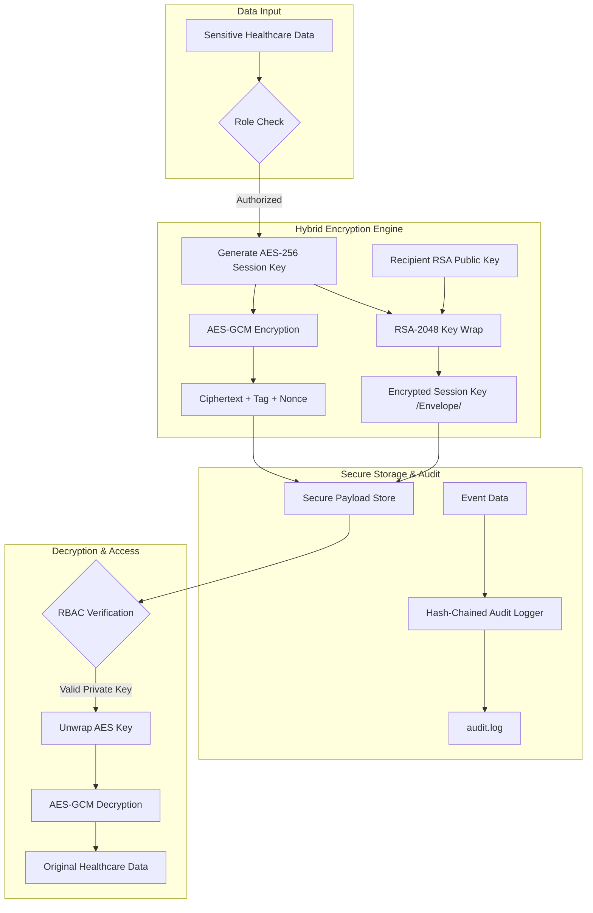
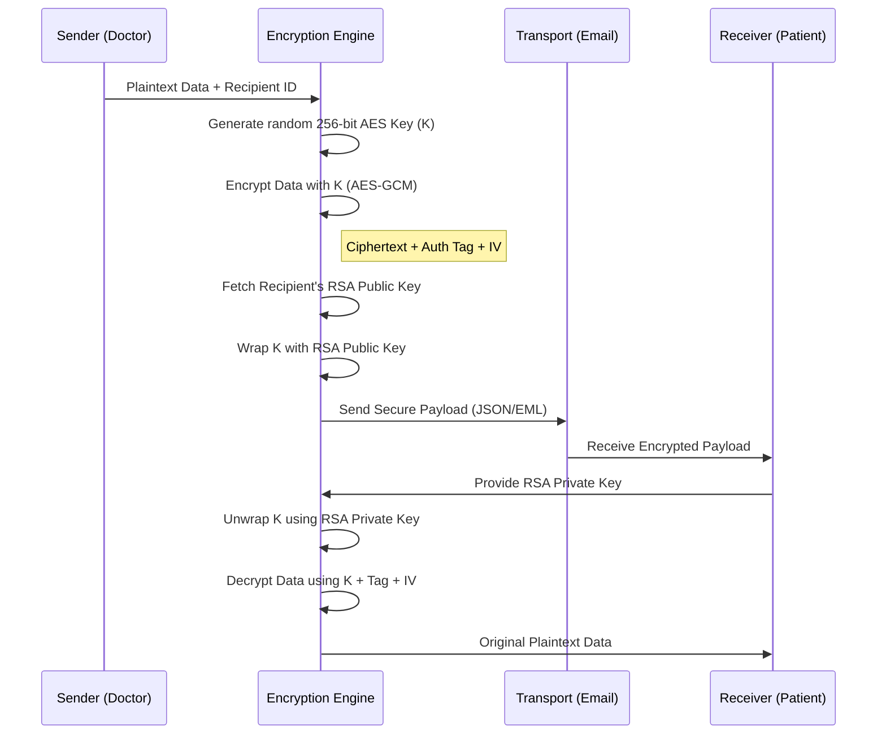
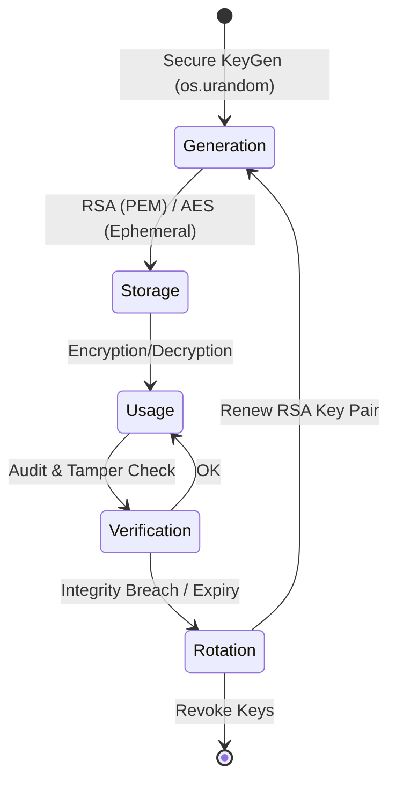

# 🔐 Advanced Secure Healthcare Crypto System

### **Enterprise-Grade Hybrid RSA–AES | Cryptographic RBAC | Hash-Chained Audit Logs**

[](https://en.wikipedia.org/wiki/RSA_(cryptosystem))
[](https://en.wikipedia.org/wiki/Galois/Counter_Mode)
[](https://en.wikipedia.org/wiki/SHA-2)

---

## 🏛️ **System Architecture**

The system employs a multi-layered security architecture designed to protect sensitive Electronic Health Records (EHR) through its entire lifecycle: **In-Transit, In-Use, and At-Rest**.

### **High-Level Flow Diagram**



### **Secure Email Exchange (Sequence Diagram)**



### **Key Lifecycle & Rotation (State Diagram)**



---

## 🧠 **Core Algorithms**

### **1. Hybrid RSA-AES Encryption Flow**
The system uses **Envelope Encryption** to combine the efficiency of symmetric encryption with the security of asymmetric key exchange.

**Encryption Procedure:**
1.  **Symmetric Key Generation**: A cryptographically secure 256-bit random key ($K_{aes}$) is generated for every operation.
2.  **Data Encryption (AES-GCM)**: 
    - The plaintext ($P$) is encrypted using AES-256 in Galois/Counter Mode (GCM).
    - **CTR Mode**: Provides confidentiality through stream encryption.
    - **GHASH**: Computes a message authentication code (MAC) for integrity.
    - $C, T = E_{aes}(K_{aes}, IV, P, AAD)$
    - Where $AAD$ is Additional Authenticated Data (Metadata).
3.  **Asymmetric Key Wrapping (RSA-OAEP)**:
    - The session key $K_{aes}$ is encrypted using RSA-2048 with **Optimal Asymmetric Encryption Padding (OAEP)**.
    - OAEP prevents plain-RSA vulnerabilities and ensures semantically secure encryption.
    - $E_{key} = E_{rsa\_oaep}(PK_{rsa}, K_{aes}, MGF1, SHA256)$
4.  **Packaging**: The final payload contains $[E_{key}, C, T, IV]$.

### **2. Hash-Chained Audit Algorithm**
To ensure log integrity, every entry is cryptographically linked to the previous one, creating an immutable chain.

**Logging Formula:**
- $H_n = \text{SHA-256}(Timestamp | Event | Message | H_{n-1})$
- Where $H_n$ is the hash of the current log entry and $H_{n-1}$ is the hash of the preceding entry.
- **Verification Logic**:
    ```python
    expected_hash = SHA256(current_entry_data + last_verified_hash)
    if current_entry.hash != expected_hash:
        raise TamperAlert("Integrity Failure detected at entry N")
    ```
- **Security Guarantee**: If any single bit in any log entry is changed, the entire chain of hashes from that point forward will fail validation.

---

## 🔐 **Cryptographic Role-Based Access Control (RBAC)**

| Role | Access Level | Cryptographic Capability |
| :--- | :--- | :--- |
| **Admin** | System-Wide | Full Audit Verification, Key Management, System Diagnostics |
| **Doctor** | Clinical-High | EHR Encryption/Decryption, DICOM Image Processing |
| **Nurse** | Clinical-Mid | EHR Decryption, Record Management |
| **Patient** | User-Specific | Personal Data Encryption, Secure Communication |

---

## 📊 **Security Dashboard Metrics**

The **Admin Dashboard** provides real-time visualization of the system's security posture:
- **Integrity Score**: Real-time status of the hash-chained audit log.
- **Encryption Throughput**: Number of RSA/AES operations processed.
- **Access Heatmap**: Distribution of logins across different roles.
- **Tamper Alerts**: Instant notification if any cryptographic signature fails verification.

---

## 🛠️ **Installation & Setup**

### **Prerequisites**
- Python 3.8+
- OpenSSL (for key generation)

### **Deployment**
1. **Clone & Install**:
   ```bash
   git clone https://github.com/faaiyaazzzz/secure-healthcare-hybrid-encryption.git
   cd secure-healthcare-hybrid-encryption
   pip install -r requirements.txt
   ```

2. **Initialize Keys**:
   The system will automatically generate the root RSA keys on first run.

3. **Start the Engine**:
   ```bash
   python app.py
   ```

---

## 🛡️ **Threat Model Mitigation**

| Threat | Mitigation Strategy |
| :--- | :--- |
| **Man-in-the-Middle (MitM)** | RSA Public Key Exchange & AES-GCM Authentication Tags |
| **Log Tampering** | SHA-256 Hash-Chaining (Blockchain-inspired integrity) |
| **Unauthorized Access** | Cryptographically enforced RBAC via Private Key ownership |
| **Brute Force** | High-entropy 256-bit AES keys and 2048-bit RSA modulus |

---

## 📜 **License**
This project is licensed under the MIT License - see the [LICENSE](LICENSE) file for details.

---

**Built with ❤️ for Healthcare Security by [faaiyaazzzz]**
