# 🔐 Advanced Secure Healthcare Crypto System

### **Enterprise-Grade Hybrid RSA–AES | Cryptographic RBAC | Hash-Chained Audit Logs**

[](https://en.wikipedia.org/wiki/RSA_(cryptosystem))
[](https://en.wikipedia.org/wiki/Galois/Counter_Mode)
[](https://en.wikipedia.org/wiki/SHA-2)

---

## 🌐 **System Overview**

This platform is a comprehensive healthcare management system that prioritizes data security above all else. It's built for hospitals and clinics to manage patient data without worrying about data breaches.

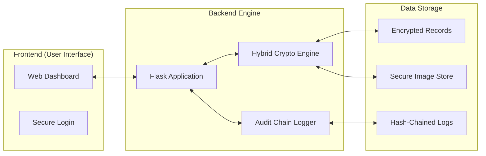

---

## 🏛️ **System Architecture**

The system employs a multi-layered security architecture designed to protect sensitive Electronic Health Records (EHR) through its entire lifecycle: **In-Transit, In-Use, and At-Rest**.

### **High-Level Flow Diagram**

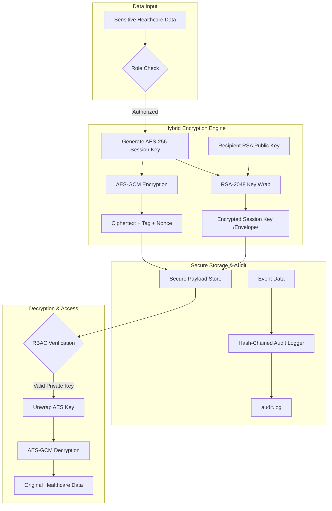

### **Secure Email Exchange (Sequence Diagram)**

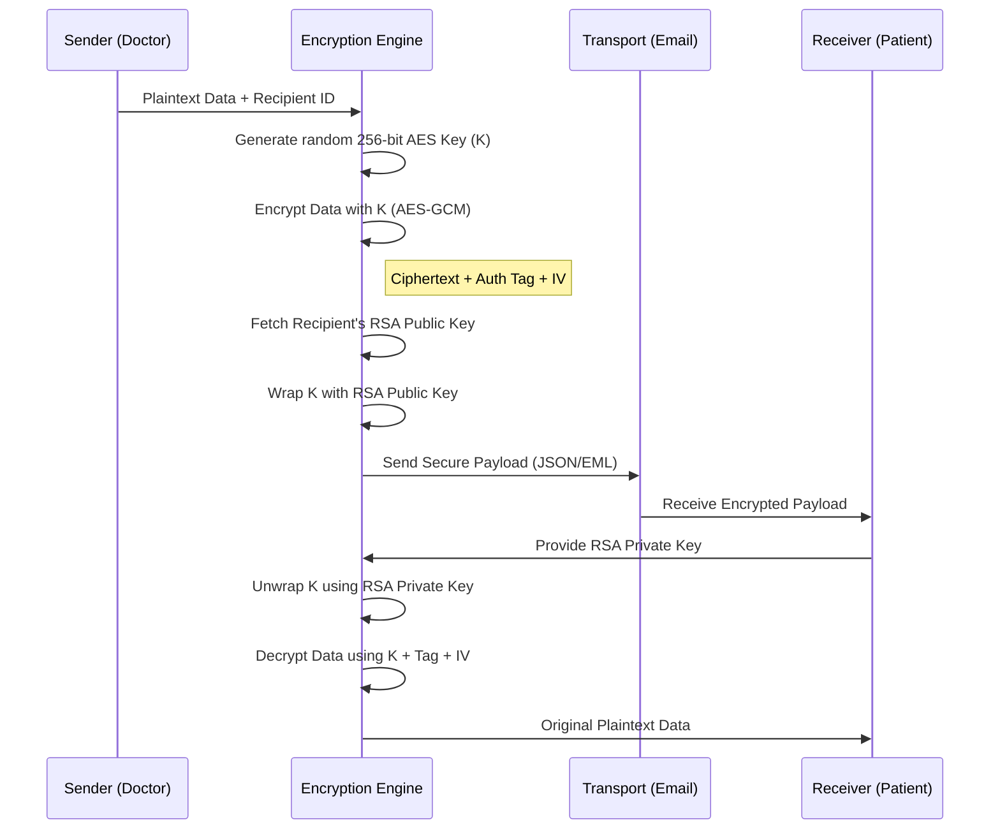

### **Key Lifecycle & Rotation (State Diagram)**

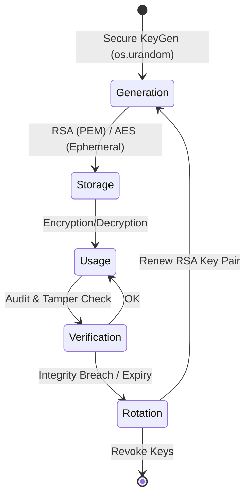

---

## 🗺️ **User Journey & Experience**

We've designed the system to be intuitive while remaining incredibly secure. Here's what a typical interaction looks like for a medical professional:

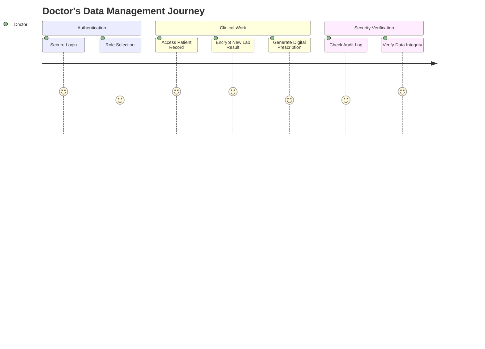

---

## 🎨 **Visual Tour (Mock Layouts)**

Since we prioritize a clean and modern user interface, here are representative layouts of our key dashboards:

### **1. Professional Login Interface**
A sleek, glassmorphism-inspired login card with a thematic healthcare background and security features like password visibility toggles.
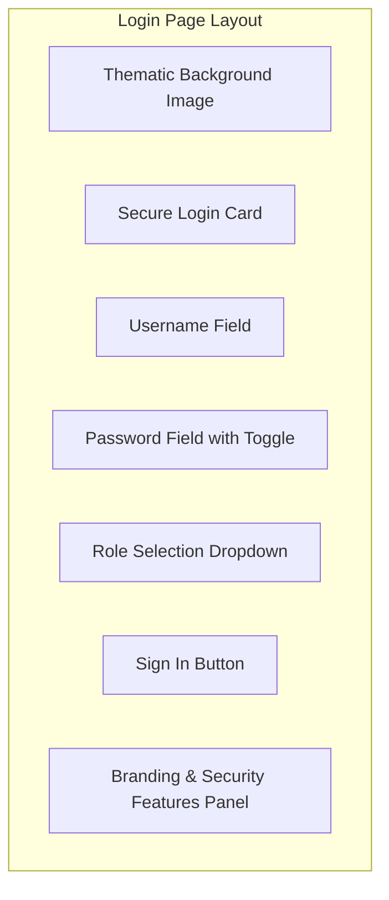

### **2. Patient Dashboard (Full-Width Focused)**
A focused view without sidebars, allowing patients to easily see their health overview and access key services.
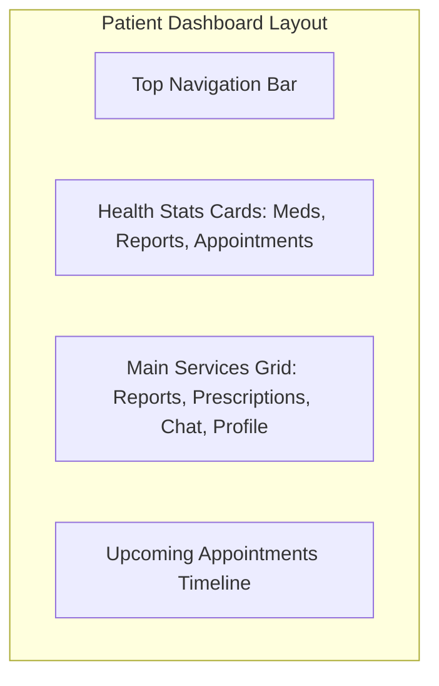

### **3. Admin Security Dashboard**
A data-driven view with real-time stats and a live activity feed.
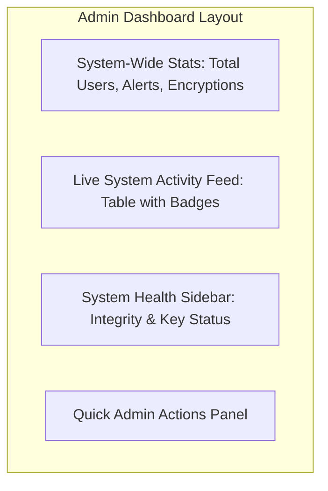

---

## 💎 **Why Choose this System?**

This platform isn't just about managing data—it's about building trust between patients and healthcare providers.

| Benefit | How we do it |
| :--- | :--- |
| **Absolute Privacy** | Using AES-256-GCM, we ensure that your records are unreadable to anyone without the proper key. |
| **Key Security** | RSA-2048 allows secure key exchange, meaning the encryption keys themselves are never exposed. |
| **Immutable History** | Our hash-chained audit log ensures that every single action is recorded and can never be altered. |
| **Professional Experience** | A clean, modern UI designed to make complex security features feel simple and intuitive. |

---

## 🧠 **Core Algorithms** (Simplified)

### **1. Hybrid RSA-AES Encryption Flow**
Imagine a lock and a key. **AES** is the fast, secure lock that protects the data. **RSA** is a special safe that holds the AES key.
1.  We generate a new AES key for every patient record.
2.  The patient's record is locked with the AES key.
3.  The AES key itself is then locked inside an RSA "safe" that only the authorized recipient can open.

### **2. Hash-Chained Audit Algorithm**
Think of this as a digital fingerprint for every action. Each log entry is linked to the one before it. If someone tries to change an old log entry, the whole chain breaks, immediately alerting the administrator.

---

## 🔐 **Cryptographic Role-Based Access Control (RBAC)**

| Role | Access Level | Cryptographic Capability |
| :--- | :--- | :--- |
| **Admin** | System-Wide | Full Audit Verification, Key Management, System Diagnostics |
| **Doctor** | Clinical-High | EHR Encryption/Decryption, DICOM Image Processing |
| **Nurse** | Clinical-Mid | EHR Decryption, Record Management |
| **Patient** | User-Specific | Personal Data Encryption, Secure Communication |

---

## 📊 **Security Dashboard Metrics**

The **Admin Dashboard** provides real-time visualization of the system's security posture:
- **Integrity Score**: Real-time status of the hash-chained audit log.
- **Encryption Throughput**: Number of RSA/AES operations processed.
- **Access Heatmap**: Distribution of logins across different roles.
- **Tamper Alerts**: Instant notification if any cryptographic signature fails verification.

---

## 🛡️ **Security Analysis & Validation**

The system undergoes rigorous cryptographic validation to ensure the randomness and robustness of the encryption. Below are the key security metrics and visualizations used for validation.

### **1. Histogram Analysis (The Complete Transformation)**
A secure encryption system should produce a flat (uniform) histogram for the encrypted image, indicating that all pixel values are equally likely and provide no information about the original data.

#### **Original Image (Predictable Peaks)**
In medical images (like X-rays), pixel values are concentrated in specific ranges, creating a "peaky" histogram.
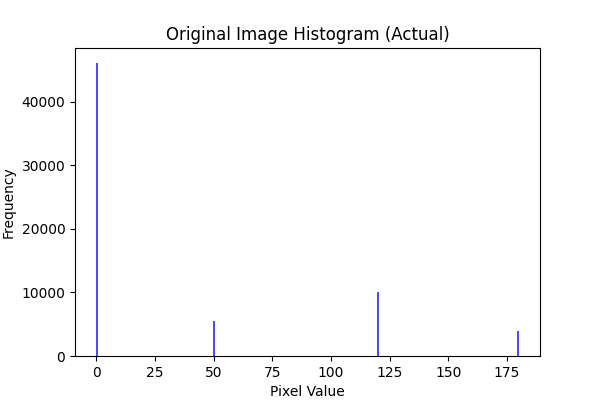

#### **Encrypted Image (Uniform Distribution)**
AES-256-GCM encryption scatters the pixel values uniformly, resulting in a flat histogram—the gold standard for cryptographic strength.
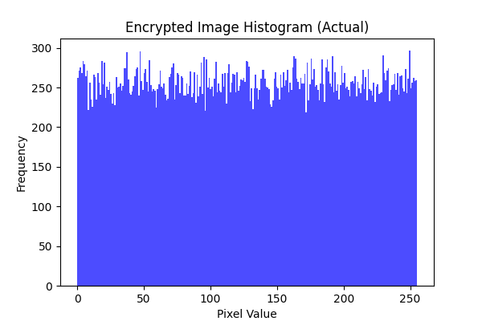

#### **Decrypted Image (Exact Restoration)**
The system guarantees lossless decryption, restoring the original pixel distribution exactly.
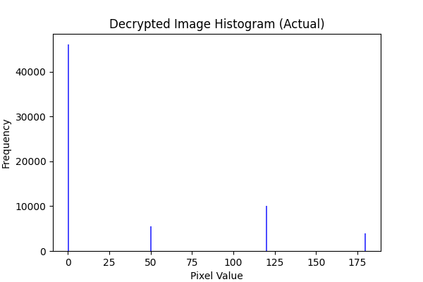

### **2. Pixel Correlation Distribution**
Adjacent pixels in medical images are highly correlated. Our encryption engine eliminates this, transforming structured data into "white noise".

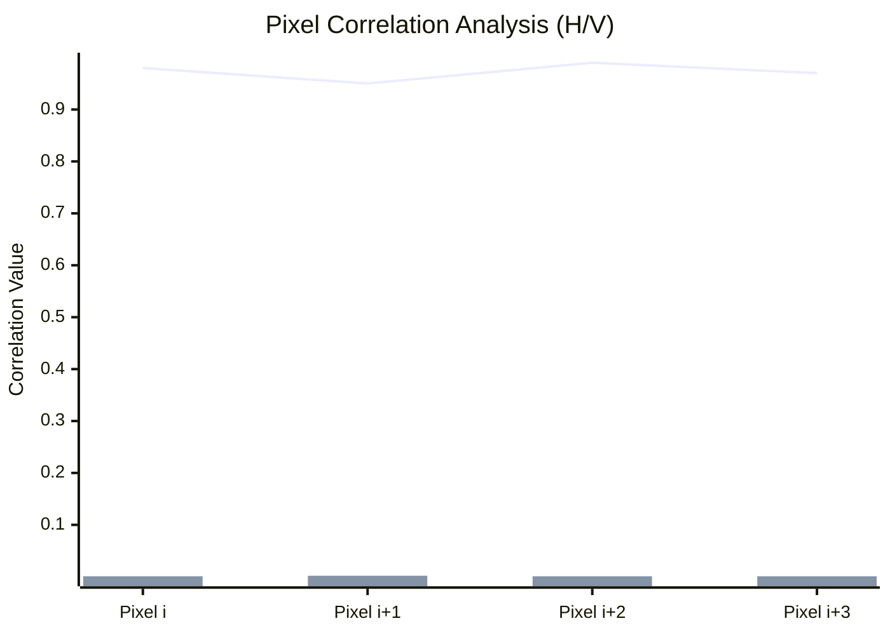
> **Legend**: The **line** represents original clinical data correlation (High), while the **bar** represents encrypted data correlation (Near-Zero).

### **3. Local Entropy Distribution Heatmap**
Entropy measures the uncertainty or randomness in an image. For medical images, original data has low entropy in consistent regions, while encrypted data should show high, uniform entropy across the entire heatmap.

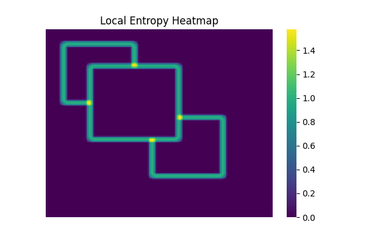

| Metric | Original Image | Encrypted Image | Ideal Value |
| :--- | :--- | :--- | :--- |
| **Shannon Entropy** | ~4.5 - 6.2 | **7.999** | **8.0** |

### **4. Differential Attack Resistance (Avalanche Effect)**
We use **NPCR** and **UACI** to measure the sensitivity of the encryption to small changes in the plaintext.

| Security Metric | Description | Validation Value |
| :--- | :--- | :--- |
| **NPCR** | Number of Pixels Change Rate | **> 99.6%** |
| **UACI** | Unified Average Changing Intensity | **~ 33.4%** |
| **PSNR** | Peak Signal-to-Noise Ratio (Decrypted) | **Infinity (Lossless)** |

---

## 📐 **Mathematical Foundations**

The security of the system is backed by rigorous mathematical models and standard cryptographic primitives.

### **1. Hybrid Encryption (Envelope Model)**
The system uses AES-256-GCM for data confidentiality and RSA-2048-OAEP for key security.

**AES-GCM Authenticated Encryption:**
$$C, T = E_{AES-GCM}(K_{session}, IV, P, AAD)$$
- $P$: Plaintext healthcare data.
- $K_{session}$: 256-bit ephemeral session key.
- $IV$: 96-bit initialization vector.
- $AAD$: Additional Authenticated Data (Metadata).
- $C$: Ciphertext.
- $T$: 128-bit Authentication Tag (MAC).

**RSA-OAEP Key Wrapping:**
$$E_K = E_{RSA-OAEP}(PK_{recipient}, K_{session})$$
- $PK_{recipient}$: Recipient's 2048-bit RSA Public Key.
- $E_K$: Encrypted (wrapped) session key.

### **2. Immutable Audit Logging (Hash-Chaining)**
Each log entry is cryptographically linked to the previous one, forming a blockchain-inspired integrity chain.

**Chaining Formula:**
$$H_i = \text{SHA-256}(T_i \parallel E_i \parallel M_i \parallel H_{i-1})$$
- $H_i$: Hash of the current log entry.
- $T_i, E_i, M_i$: Timestamp, Event Type, and Message.
- $H_{i-1}$: Hash of the immediately preceding entry.
- $\parallel$: Concatenation operator.

### **3. Security Validation Metrics**
We use the following formulas to validate the randomness and robustness of our image encryption engine.

**Shannon Entropy (Randomness):**
$$H(X) = -\sum_{i=0}^{255} P(x_i) \log_2 P(x_i)$$
- $P(x_i)$: Probability of pixel value $i$ occurring in the image.

**NPCR (Number of Pixels Change Rate):**
$$NPCR = \frac{\sum_{i,j} D(i,j)}{W \times H} \times 100\%$$
- $D(i,j) = 1$ if $c_1(i,j) \neq c_2(i,j)$, else $0$.

**UACI (Unified Average Changing Intensity):**
$$UACI = \frac{1}{W \times H} \left[ \sum_{i,j} \frac{|c_1(i,j) - c_2(i,j)|}{255} \right] \times 100\%$$

**Correlation Coefficient:**
$$r_{xy} = \frac{\sum (x_i - \bar{x})(y_i - \bar{y})}{\sqrt{\sum (x_i - \bar{x})^2 \sum (y_i - \bar{y})^2}}$$

---

## 🛠️ **Installation & Setup**

### **Prerequisites**
- Python 3.8+
- OpenSSL (for key generation)

### **Deployment**
1. **Clone & Install**:
   ```bash
   git clone https://github.com/faaiyaazzzz/secure-healthcare-hybrid-encryption.git
   cd secure-healthcare-hybrid-encryption
   pip install -r requirements.txt
   ```

2. **Initialize Keys**:
   The system will automatically generate the root RSA keys on first run.

3. **Start the Engine**:
   ```bash
   python app.py
   ```

---

## 🛡️ **Threat Model Mitigation**

| Threat | Mitigation Strategy |
| :--- | :--- |
| **Man-in-the-Middle (MitM)** | RSA Public Key Exchange & AES-GCM Authentication Tags |
| **Log Tampering** | SHA-256 Hash-Chaining (Blockchain-inspired integrity) |
| **Unauthorized Access** | Cryptographically enforced RBAC via Private Key ownership |
| **Brute Force** | High-entropy 256-bit AES keys and 2048-bit RSA modulus |

---

## 📜 **License**
This project is licensed under the MIT License - see the [LICENSE](LICENSE) file for details.

---

**Built with ❤️ for Healthcare Security by [Mansuri Faiyaz]**
